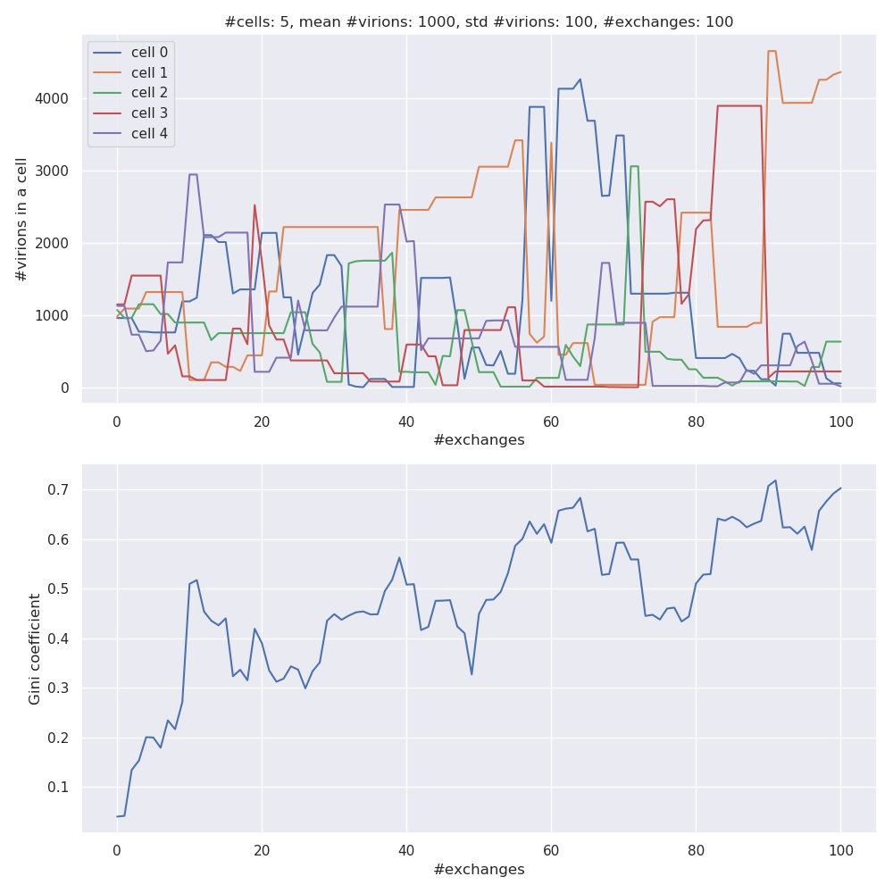
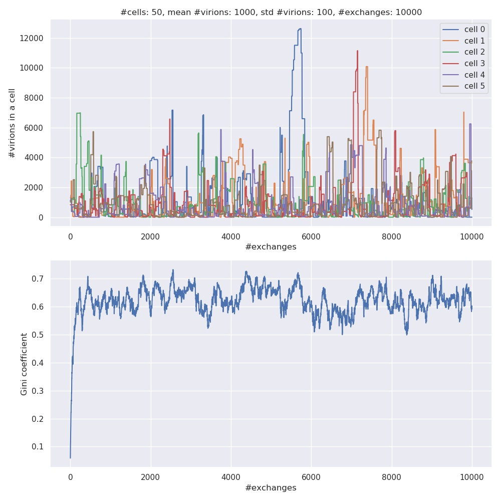
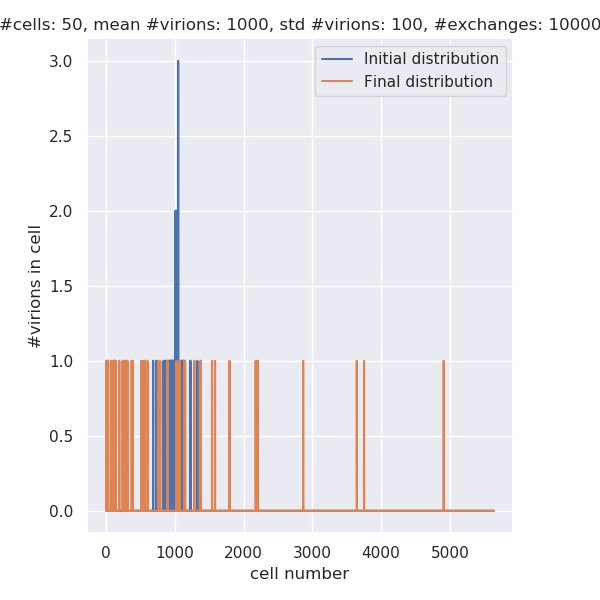
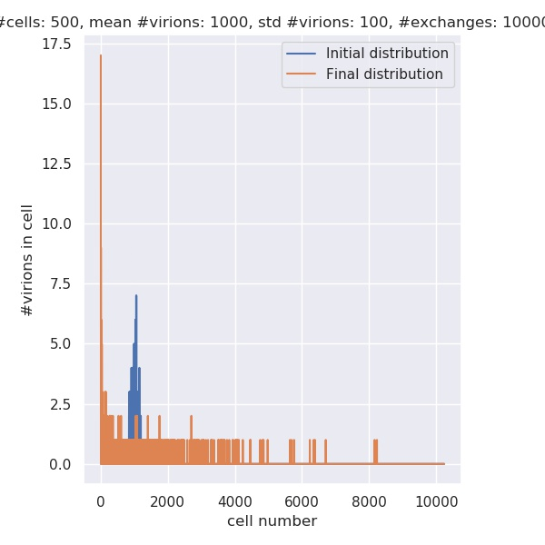
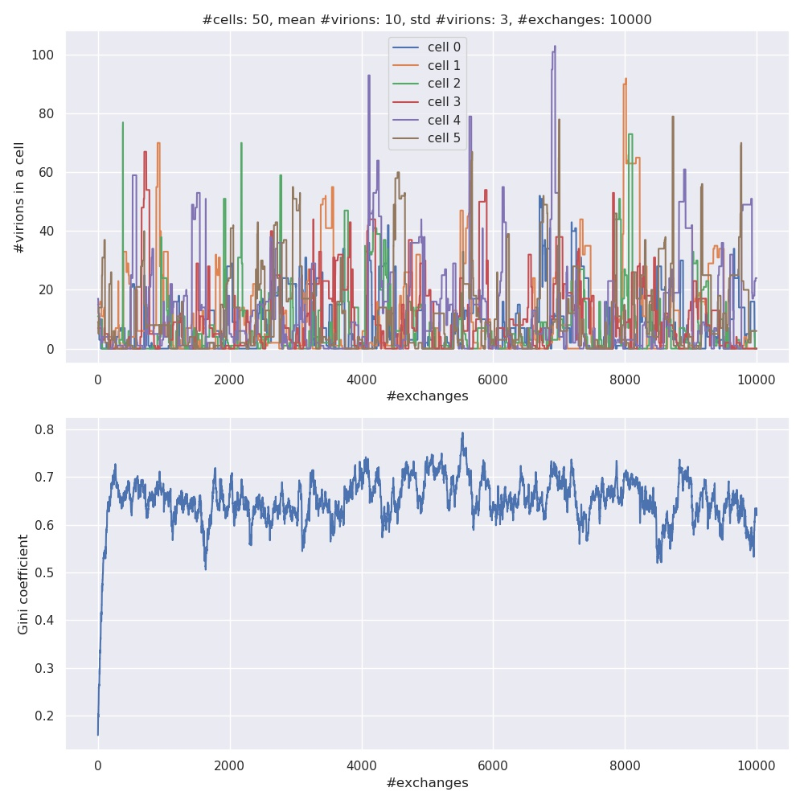
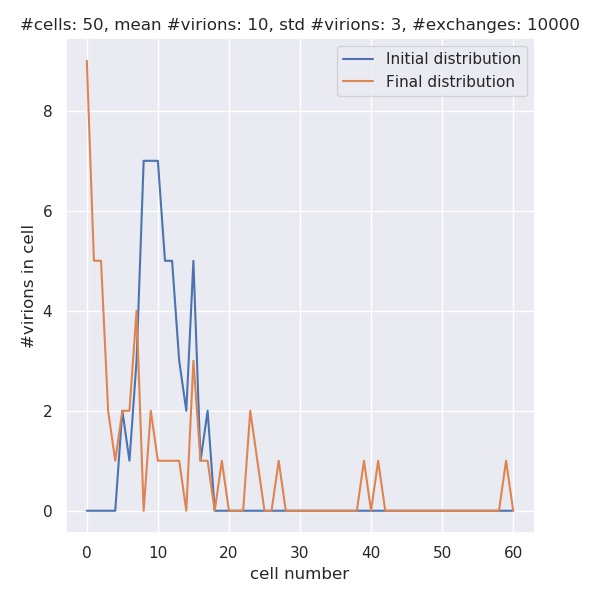

#Simulation fo RNA viruses

*REMARK: this project was done as a small freelance job (1-2h of work). The original assignment contains some imprecisions. In particular "exchange" of virions is replace by "transfer" of virions, and Gini coefficient has maximum value 1-1/N rathe rthan 1.*

##Assignment  
Create a simulation of viruses (RNA entities) that are infecting a host (a system of cells). For simplicity, let’s assume that all cells are of the same type and function and that all viruses are of the same type too (same RNA). Specifically:
 
* Start by instantiating a population of N cells which are unequally infected by 0 to many viruses (the correct term is virions, which are copies of the same virus); the number of virions inside the system follow a normal distribution (some cells contain few virions, many cells contain a “mean” number of virions and some cells contain many virions). Therefore, the total amount of virions is Gaussian distributed across the infected system. Initialize the system with N cells and a given mean of virions. 
* Cells can swap virions among each other randomly; this means that any two random cells can exchange an x number of virions, with x in the range between 0 and maximum total number of contained virions of both cells. Model this process. 
* Use the Gini coefficient of statistical dispersion to model and understand the distribution of virions among the cells. The Gini coefficient is: , where y = number of virions in a cell, ordered from highest to lowest, i = rank, and n = number of cells. G = 0 means equal distribution of virions among cells and G = 1 means only one cell has all the numbers of virions (“perfect inequality”); both are ab absurdo scenarios. Plot the initial distribution of cells and virions and calculate the Gini coefficient of the system. 
* Simulate a small number viral exchanges between a small number of cells (i.e., 100 exchanges between 5 cells) and print out the number of virions in each cell at each timestep. 
* Scale up the simulation to any number of timesteps and initial cells you want (pay attention that there are combinatorial effects of computing time, and your simulation might crash easily, therefore scale up marginally). Plot the time series of the Gini coefficient. Plot the distribution of cells at the start of the simulation and at the end of the simulation. What has changed? 
* Change the initialization of the population of cells to be uniformly distributed and replot the timeseries of the Gini coefficient and the initial and final distributions of infected cells. (10 pt.) 1 E.g., influenza virus can contain 500-1000 virions inside a cell, while HIV can contain about 1-12 

##Results  
###Simulation with 5 cells and 100 exchange events
The numbers of virions in cells and the Gini index for the initial simulation with 5 cells and 100 exchange events are shown in the figure below:

###Scaled-up simulation  
Below is the result of a scaled-up simulation with 50 cells and 10000 exchange events
 

###Distributions at the start and the end of the simulation  
Due to the relatively narrow width of the initial Gaussian distribution the initial numbers of virions in cells are approximately equal, which results in low Gini coefficient. Later one obtains very uneven distribution of virions between cells and much higher G. The initial and the final distributions are shown below (`N = 50, n = 10000`):

In order to have a smoother bell-shaped Gaussian curve in the beginning one may run simulation with a greater number of cells, e.g. N = 500, n = 10000:

###Influenza vs. HIV  
We have run the simulation for Influenza case (taking the average number of virions in the cell to be 1000). We now rerun it for HIV (average number of virions: 10, standard deviation: 3, N = 50, n = 10000)  

